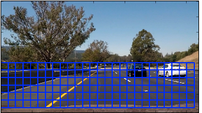
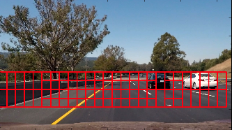
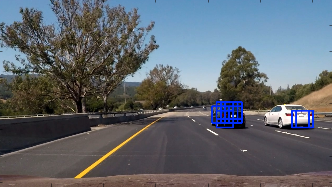
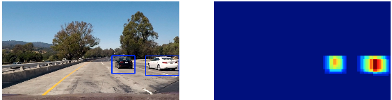
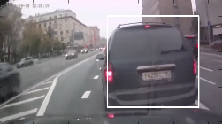

# Vehicle Detection

## Classifier

A SVM Classifier was used with the following to achieve a Test Accuracy of SVC =  0.9935.

|Parameter|Value|
|-----|----|
|C|1.0|
|fit_intercept|True|
|tol|.0001|
|verbose|0|
|multi-class|ovr|
|dual|True|
|loss|Squared Hinge|
|Max Iter|1000|
|Intercept Scaling|1|
|Penalty|l2|

## Finding a car

To find a car we
1. Calculate Hog features for entire Image
1. Extract sub-image
1. Find color histograms for sub image
1. Find spatial signature for sub image
1. Scale and Predict image
1. If Positive prediction, add to a list of rectangles

## Histograms of Gradients, Color and Spatial Values

The features for the SVM are extracted from
1. Histogram of Gradient directions
1. Histogram of raw color Values
1. Histogram of raw color values in **order**

### color_hist

The total histogram of color values for each color channel is calculated with `np.histogram` inside of the `color_hist` function. This gives us an unordered set of features.

### bin_dist

Similar to `color_hist` we also get a histogram of color intensities but this time with their order being important. Color channels 0, 1, and 2 will always be present in that order. What we return is essentially a flat ndarray with pixel intensities listed in order. The input image is resized to a lower resolution.

### Histogram of Gradients

Each square is broken up into *8x8* pixel squares. These cells computing gradients (directions) of colors. The number of orientations tell us the total number of bins in a histogram that we want to return. The resulting histogram will tell us the total magnitude of most 'direction' of a cell.

## Sliding Window Search

The initial image fed into the camera needs to be divided into different sizes and number of squares to scan to look for cars. Since the back side of a car is very square, shapes are often of the form *nxn*.

In the coursework we used `slide_window` to shift through a series of windows but in `find_cars` we can use

>`subimg = cv2.resize(ctrans_tosearch[ytop:ytop+window, xleft:xleft+window], (64,64))`

to extract the sub image and then run it through the different scaling and prediction methods for the classifier.

## Video Implementation

1. Generate Squares where a car might be found
1. Generate a heatmap
1. Draw Squares
1. (Bonus!) Detect a braking situation

### Generate squares

The total number of squares to look through can be very large. To keep this form happening we use only certain sized squares on certain parts of the iamge. See `_pipeline`.

### heatmap

We can anticipate having multiple detections per pass as well as transient false positives.

To get around this we use a heatmap as presented by sklearns `label` functionality. We set the minimum heatmap heat to be 2.

### Draw final squares around heatmap labels

Looking at the heat map we can see that the 'hotter' an image is the slower it is moving. The black car was moving faster than the white car in the input image.

### Detect a collision from rear ending

This was implemented with a special square generated that detects a very large car directly in the center of the image.

This image was the last frame before a collision in a [YouTube video](https://www.youtube.com/watch?v=NOSDIi5wbWU#t=2m12s) I scanned:

## Possible new features

### Tracking and Prediction

It'd be great to predict the trajectory of a car. Here's how we do it

1. Flatten out image
1. Find centroid of an image
1. Record a few points of the centroids
1. use `np.polyfit` to create a polynomial
1. Use that polynomial to draw an image on flattened image
1. Unflatten image to output

The hard part might being trying to calculate what a box is matching what car on the image. Other wise a naive polyfit will try to polyfit every single point for all cars detected.

The usefulness of this could be to find polynomials that have a large change in direction which indicates a collision in progress, but not involving the car filming.
